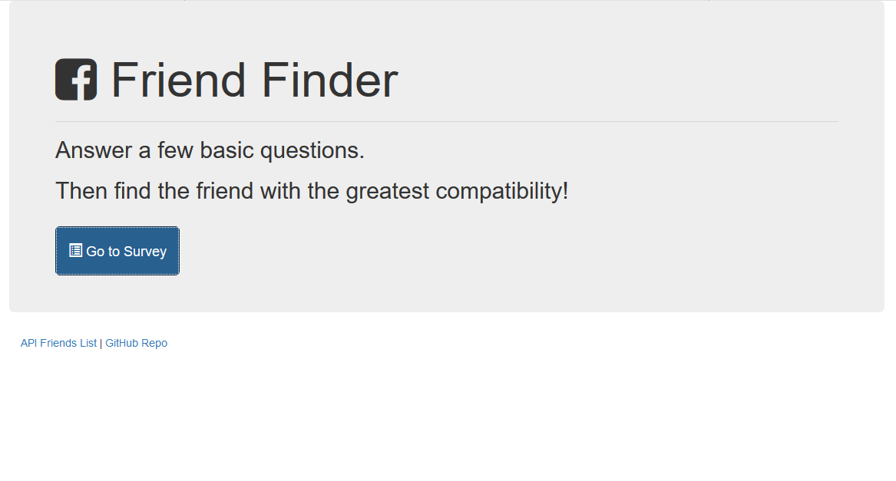
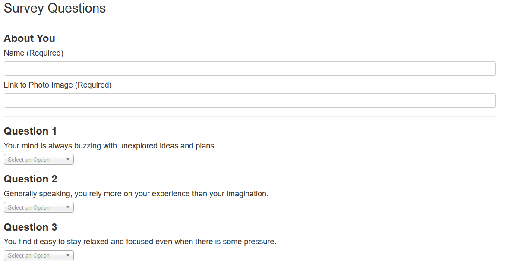
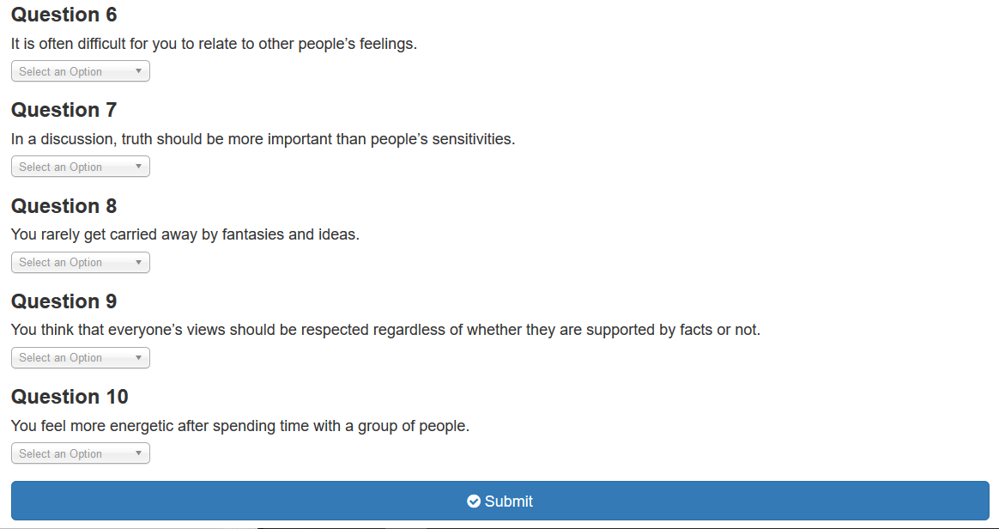
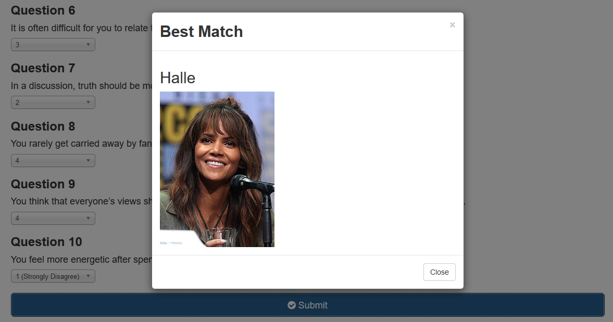

# FriendFinder

An app which finds friends based on the best match of compatibility via the scores of a survey taken by the user.

## How to Use

User opens application via the Heroku [link](https://friendfinderwh.herokuapp.com/) to the homepage and clicks on "Go to Survey". User then provides their name, a picture of themselves linked from the web (i.e., a social media account profile pictire), and answers to ten statements using the drop-down choices numbered one through five, with one expressing the strongest disagreement to the statement, and five expressing the strongest agreement.

Upon completing the survey, the user clicks "Submit" and is shown the person with whom he or she has the most compatibility based on the answers which were given.

App also contains a link to the JSON data, which contains an array of people ("friends") and their scores, which are compared against data from the user to determine compatibility.

### Prerequisites

npm [express](https://www.npmjs.com/package/express)

npm [path](https://www.npmjs.com/package/path)

npm [bodyParser](https://www.npmjs.com/package/body-parser)

### Technologies Used

Languages - HTML5, CSS4, JavaScript

Libraries - Bootstrap, jQuery

Run-time system - Node.js

Other tools, technologies, and techniques - API Routes

Text Editor - Visual Studio Code

## Preview

### Homepage
- - - -

### Beginning of Survey
- - - -

### End of Survey and Submit Button
- - - -

### Friend Revealed
- - - -

## Contributing

Please feel free to branch off with tweaks and making a repo; open to suggestions!

## Future Development

* Allowing for photos to be uploaded from user device drive
* Perfect the logic for finding friends

## Authors

* **Wesley Hutchins** - [Github](https://github.com/WesPres1990)